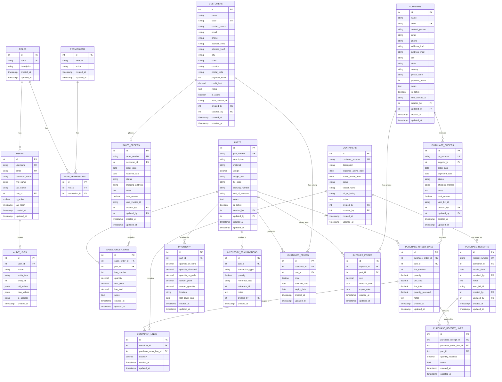

# Milson ERP - Database Schema

## Entity Relationship Diagram

## Table Details

### Status Enums

**Sales Order Status:** Draft, Confirmed, In Progress, Shipped, Delivered, Cancelled

**Purchase Order Status:** Draft, Sent, Confirmed, Partially Received, Received, Cancelled

**Container Status:** Pending, In Transit, At Port, Customs, Arrived, Received

### Indexes

- `users`: username, email, role_id
- `parts`: part_number
- `suppliers`: code
- `customers`: code
- `sales_orders`: order_number, customer_id, status
- `sales_order_lines`: sales_order_id, part_id
- `purchase_orders`: po_number, supplier_id, status
- `purchase_order_lines`: purchase_order_id, part_id
- `containers`: container_number, status
- `container_lines`: container_id, purchase_order_line_id
- `purchase_receipts`: receipt_number, container_id
- `purchase_receipt_lines`: purchase_receipt_id, purchase_order_line_id
- `inventory`: part_id (unique)
- `inventory_transactions`: part_id, transaction_type
- `audit_logs`: entity_type, entity_id, user_id, created_at
- `customer_prices`: customer_id, part_id
- `supplier_prices`: supplier_id, part_id
